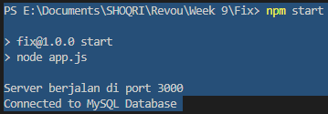

[](https://classroom.github.com/a/Z42oEjTh)

## MBanking App API - Backend Implementation

This repository contains the backend code for the MBanking App API, built using Node.js and MySQL. The API provides functionalities to manage user information and transactions.

### Database Setup

1. Create the MySQL database by executing the following SQL query:

```sql
CREATE DATABASE mbanking;
```

2. Create the `user` table with the following SQL query:

```sql
CREATE TABLE user (
  id INT PRIMARY KEY AUTO_INCREMENT,
  name VARCHAR(255) NOT NULL,
  address VARCHAR(255) NOT NULL
);
```

3. Create the `transactions` table with the following SQL query:

```sql
CREATE TABLE transactions (
  id INT PRIMARY KEY AUTO_INCREMENT,
  user_id INT NOT NULL,
  type ENUM('income', 'expense') NOT NULL,
  amount DOUBLE NOT NULL,
  FOREIGN KEY (user_id) REFERENCES user(id)
);
```

### Connecting to the Database

To connect Node.js to the MySQL database, update the `db.js` file with your MySQL server configuration.

```javascript
const mysql = require('mysql2');

const db = mysql.createConnection({
  host: 'your-mysql-host',
  port: 'your-mysql-port',
  user: 'your-mysql-user',
  password: 'your-mysql-password',
  database: 'your-database'
});

// ...
```

### API Endpoints

#### User Information

- `GET /user/:id`: Retrieve user information, balance, and total expenses based on user ID.

#### Transactions

- `POST /transaction`: Add a new income/expense transaction.
- `PUT /transaction/:id`: Update an existing transaction.
- `DELETE /transaction/:id`: Delete a transaction.

### API Usage

- Make sure the MySQL server is running and properly set up.
- Use a Postman to interact with the API endpoints.

### Documentation Screenshots

1. Syntax for creating the database table (User and Transaction tables):

   

2. Successfully connecting the database to Node.js locally:

   

3. Deployment Link :

   _[Database & Backend Deploy Link](https://week-9-shoqrizidan-production.up.railway.app/)._

### Thank you.
